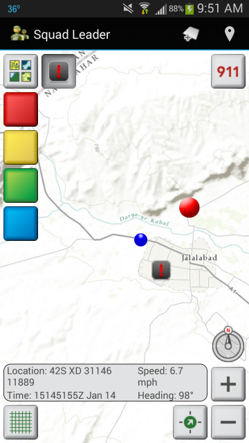

squad-leader-android
====================

The Squad Leader template demonstrates best practices for building handheld military applications with the ArcGIS Runtime SDK for Android. The Squad Leader template contains source code for a handheld application and directions for building the application from source.



## Sections

* [Requirements](#requirements)
* [Release Notes](#release-notes)
* [Instructions](#instructions)
    * [Building from Source](#building-from-source)  
    * [Running Unit Tests](#running-unit-tests)
* [Resources](#resources)
* [Issues](#issues)
* [Contributing](#contributing)
* [Licensing](#licensing)

## Requirements

To run the app:

- Android 4.0.3 or higher
  - Limited functionality when running on an Android emulator ([more info](#notes-on-running-with-the-android-emulator))
- In the Android device's settings, if Developer Options are available, ensure that **"Don't keep activites"** or **"Do not keep activities"** is **unchecked**. See the [User Guide](documentation/UserGuide.md#uncheck-dont-keep-activities) for details.

To build the app from source:

- Android SDK components (install with Android SDK Manager, available in Android Studio under **Tools > Android > SDK Manager**)
  - SDK Platform for Android 4.0.3 (API 15) or higher
  - Android SDK Tools (tested with version 26.0.2)
  - Android SDK Platform-tools (tested with version 25.0.6)
  - Android SDK Build-tools (tested with version 25.0.3)
  - Android Support Repository (tested with version 47.0.0)
  - Android Support Library (tested with version 23.2.1)
- [ArcGIS Runtime SDK 10.2.9 for Android](https://developers.arcgis.com/en/downloads/)
  - Even though the repository contains references to the online SDK in Android Studio, you'll need to download the SDK to get the native binary files used for visual analysis (see [build steps](#building-with-android-studio)).
  - Download the latest 10.2.9 update. Right now, the latest update is version 10.2.9. A future update may be named 10.2.9-1 or similar.
- Java Development Kit (JDK) 7 or higher
- One of the following:
  - [Android Studio](http://developer.android.com/sdk/index.html) (**recommended**)
    - Tested with version 2.3.2
    - Includes Gradle
  - [Gradle](http://gradle.org/)

## Release Notes

### 6.0.0
* Uses ArcGIS Runtime 10.2.9
* Identify and popup for GeoPackage features
* Edit attributes for GeoPackage features
* Delete GeoPackage features
* Added Android appcompat support library

### 5.0.0
* Uses ArcGIS Runtime 10.2.8-1
* Added GeoPackage layer type
* Added feature editing for any FeatureLayer that has an editable FeatureTable, such as GeoPackages and feature services
* Various minor improvements and refactoring

### 4.0.0
* Uses ArcGIS Runtime 10.2.7
* Requires Android 4.0.3 or higher
* Added Mil2525CMessageLayer layer type for GeoMessage files (see the [User Guide](documentation/UserGuide.md#geomessage-files-and-layers))
* Refactored the location capabilities
  * When users choose a location mode and optionally a GPX file, Squad Leader saves those choices and uses them next time the app runs (see the [User Guide](documentation/UserGuide.md#change-settings)).
  * An IT professional deploying the app can place a simulation.gpx file in the SquadLeader directory that will be used if the user has not specified location preferences (see the [User Guide](documentation/UserGuide.md#gps-simulation)).
  * Developers can open strings.xml and set the value of gpx_resource_path to a resource path that references a GPX resource in the project.
* Migrated from Eclipse to Android Studio
* Removed dependency on Android Support Library v7 appcompat

### 3.1.0
* Changed geography from Afghanistan to California.
    * IMPORTANT: if you upgrade to 3.1.0 and you don't have your own mapconfig.xml file, you must do one of the following to force Squad Leader to reset the map configuration:
        * In Squad Leader, go to **Settings** and choose **Reset map**.
        * Go to your device's application settings, choose **Squad Leader**, and choose **Clear Data**.
    * You can use mapconfig.xml to adjust the geography as desired.
    * The Afghanistan data files are available in the [3.0.0 release](../../tree/v3.0.0).

### 3.0.0
* Uses ArcGIS Runtime 10.2.4.
  * If you built Squad Leader with a previous version of ArcGIS Runtime, you need to follow the step in [Building with Android Studio](#building-with-android-studio) below about copying the MIL-STD-2525C symbol dictionary into your clone. ArcGIS Runtime 10.2.4 will not work with older versions of the symbol dictionary.
* Requires Android 4.0.1 or higher
* Viewshed analysis
    * Requires Android 4.1 (Android API level 16) or higher
    * Viewshed requires elevation data on the device. See the [User Guide](documentation/UserGuide.md#configuring-viewshed-analysis) for configuration details.
* GeoMessage management (e.g. chem lights, spot reports, and position reports):
    * The user can remove all messages of a certain type or all messages of all types from the map, with the option to send a remove message for messages created by this user to other clients.
    * The user can modify or remove a chem light.
    * The app recognizes the new "removeall" GeoMessage action, which removes all messages of a certain type:
    ```
        <geomessage v="1.0">
            <_type>chemlight</_type>
            <_action>removeall</_action>
            <_id>{2e50e7ea-c76a-11e4-8731-1681e6b88ec1}</_id>
        </geomessage>
    ```
* Using a client ID and license string that are configurable in strings.xml. Note that the current code only requires a Runtime Basic license, so the license string is optional.
* Disabled the button that hides labels. Hiding labels on military symbols does not work in ArcGIS Runtime 10.2.4 (NIM102986). When the Runtime issue is fixed, we will re-enable the button that hides labels.

## Building from Source

1. Clone this repository, or fork it and clone your fork.
1. Obtain the libraries required for offline viewshed analysis.
    1. Download and unzip the ArcGIS Runtime SDK 10.2.7 for Android.
    1. Go to `arcgis-android-sdk/libs` and copy the `armeabi`, `armeabi-v7a`, and `x86` directories to your clone's `source/SquadLeader/app/src/main/jniLibs` directory.
    1. In each of these newly copied directories in your clone's `source/SquadLeader/app/src/main/jniLibs` directory, delete `libruntimecore_java.so`.
    1. NOTE: If app size is an issue and you know you don't need to run Squad Leader on a particular platform, you can omit one or more of the three directories.
1. Copy the MIL-STD-2525C symbol dictionary into your clone:
    1. If you cloned a previous version of the Squad Leader code, delete the contents of `source/SquadLeader/app/src/main/assets/2525cSymDictionary` except for `.gitignore`.
    2. From the ArcGIS Runtime SDK you unzipped in the previous step, copy the contents of `arcgis-android-sdk/resources/mil2525c` to the `source/SquadLeader/app/src/main/assets/2525cSymDictionary` directory in your Squad Leader clone. In other words, the `messagetypes` directory and the `mil2525c.dat` file go in the `2525cSymDictionary` directory.
1. In your clone, open `source/SquadLeader/app/src/main/res/values/strings.xml` and adjust the values of `clientId` and `licenseString` as needed. Refer to [the documentation on licensing an ArcGIS Runtime app](https://developers.arcgis.com/android/guide/license-your-app.htm) for details. Note that the 4.0.0 release of Squad Leader uses only Runtime Basic functionality in ArcGIS Runtime 10.2.7, which means the license string is optional. A valid client ID will disable the "Licensed for Developer Use Only" watermark that otherwise appears on the map.
1. Follow [Building with Android Studio](#building-with-android-studio) or [Building with Gradle](#building-with-gradle) below.

### Building with Android Studio

1. Start Android Studio and open the Squad Leader project by choosing **Open an existing Android Studio project** on the start screen. In the **Open File or Project** dialog, navigate to your clone, choose `source/SquadLeader`, and click OK.
    1. Android Studio may present a dialog entitled **Unregistered VCS root detected**. If so, choose **Add root** if you would like Android Studio to work with Git and GitHub.
1. For convenience, open the project tool window by choosing **View > Tool Windows > Project** if it is not already visible.
1. In Android Studio, click the **Sync Project with Gradle Files** button, or choose **Tools > Android > Sync Project with Gradle Files**. Wait a few seconds for the Gradle sync to complete.
1. In Android Studio, click the **Make Project** button, or type Ctrl-F9. Wait a few seconds for the build to complete.
1. To run the app, connect an Android device by USB, then click the **Run** button, or type Shift-F10.
1. To generate an Android installer (APK) file, go to **Build > Generate Signed APK**.

### Building with Gradle

1. Open a command prompt and navigate to your clone. Inside your clone, navigate to `source/SquadLeader`.
1. In the command prompt, set the ANDROID_HOME environment variable to the location of your Android SDK installation. This is likely to be `C:\Users\<username>\AppData\Local\Android\sdk`. (You can set this variable in your system before starting the command prompt if desired.)
1. On Windows, run `gradlew.bat assemble`. On Linux, run `./gradlew assemble`.
1. When the build successfully completes, `.apk` files are written to `source/SquadLeader/app/build/outputs/apk`.

## Running Unit Tests

### Running Unit Tests using Android Studio

1. Follow the [Building from Source](#building-from-source) and [Building with Android Studio](#building-with-android-studio) steps above, except that there is no need to run the app or generate an APK file.
1. In Android Studio, go to **Run > Edit Configurations**. Click the green **+** button in the upper left corner and choose **Android Tests**. Change the **Name** to **All Tests**. On the General tab, change the value of **Module** to **app**. Adjust the **Target Device** as needed; **Show chooser dialog** allows you to choose a specific device or emulator each time you run the tests. Click **OK**. This adds a unit testing configuration to the project.
1. Select the Debug/Run Configuration dropdown and change from **app** to **All Tests**.
1. Click the **Run** button, or type Shift-F10.

## Notes on Running with the Android Emulator

1. Like any app using ArcGIS Runtime for Android, Squad Leader can run on an Android emulator.
1. If you wish to run in an emulator, you must follow the directions in [this blog post](http://blogs.esri.com/esri/arcgis/2012/05/02/arcgis-runtime-sdk-for-android-v1-1-supports-android-emulator/) to ensure that the emulator has proper hardware GPU support.
    1. A sample emulator configuration is shown at (documentation/dev-screen-shots/SampleEmulator.jpg)
1. IMPORTANT NOTE: the Android emulator runs in a firewall-restricted sandbox that cannot communicate over UDP with outside processes, meaning you cannot send or receive Geomessages (spot reports, etc.) from or to Squad Leader running on an emulator.

## Notes on Submodules used by the Repo

Squad Leader leverages the following as submodules of the squad-leader-android repository. 

* [military-apps-library-java](https://github.com/Esri/military-apps-library-java) 
* [aFileChooser](https://github.com/garys-esri/aFileChooser)
 
If you should want to update to the latest commit instead of the commit used by the squad-leader-android commit you're using, you can open a GitHub shell in squad-leader-android and run the following:

  <code>$ cd .\source\military-apps-library-java</code>  
  <code>$ git pull origin master</code>

## User Guide

More information for configuring and running the application see the [User Guide](documentation/UserGuide.md)

## Resources

* Learn more about Esri's [ArcGIS for Defense solution](http://solutions.arcgis.com/defense/).

## Issues

Find a bug or want to request a new feature?  Please let us know by submitting an issue.

See [Issues](https://github.com/Esri/squad-leader-android/issues) for a list of known issues.

Of particular note is [issue 84: Squad Leader app freezes when it's been running for some period of time](https://github.com/Esri/squad-leader-android/issues/84) . On some devices, we have noticed that the Squad Leader application will freeze after a few minutes of inactivity. In this situation, the application should be stopped and then started again. This issue will be addressed in a future release.

## Contributing

Esri welcomes contributions from anyone and everyone. Please see our [guidelines for contributing](https://github.com/esri/contributing).

## Licensing

Copyright 2013-2017 Esri

Licensed under the Apache License, Version 2.0 (the "License"); you may not use this file except in compliance with the License. You may obtain a copy of the License at

   http://www.apache.org/licenses/LICENSE-2.0

Unless required by applicable law or agreed to in writing, software distributed under the License is distributed on an "AS IS" BASIS, WITHOUT WARRANTIES OR CONDITIONS OF ANY KIND, either express or implied. See the License for the specific language governing permissions and limitations under the License.

A copy of the license is available in the repository's [license.txt](license.txt) file.

Portions of this code use other Esri libraries, also governed by the Apache License:

- military-apps-library-java

Portions of this code use third-party libraries and other materials:

- Use of aFileChooser is governed by the Apache License.
- Some icons come from Google's [Material Design](https://material.io/icons/), and use of those icons is governed by the Apache License.
- Use of the JSON Java library available at http://www.json.org/java/index.html is governed by the JSON License.

See [license-ThirdParty.txt](license-ThirdParty.txt) for the details of these licenses.

This repository contains elevation data from the Shuttle Radar Topography Mission (SRTM). See [license-ThirdParty.txt](license-ThirdParty.txt) for dataset citation details.
