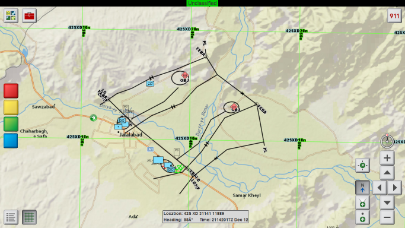

# vehicle-commander-java
 
The Vehicle Commander template demonstrates best practices for building in-vehicle military applications with ArcGIS.  The Vehicle Commander template contains source code for an in-vehicle application and directions for building the application from source. 



## The Vehicle Commander

* Displays high-performance touchscreen maps, including provisioned basemaps and operational data
* Displays a GPS location (simulated or serial GPS)
* Communicates with other machines running Vehicle Commander to display their GPS locations
* Allows users to open map packages as layers on the map
* Allows users to run viewshed analysis using a geoprocessing package

## About the Readme documentation
The documentation is divided between Quick Start, Detailed Usage, and other sections. These sections include: 

* [Hardware and software requirements](#hardware-and-software-requirements)
* [Quick Start and Build Instructions](#quick-start-instructions)
* [Release Notes](#release-notes)
* [Detailed Usage](#detailed-instructions)
* [Conclusion](#conclusion)

## General Help

* [User Guide](documentation/UserGuide.md)
* [New to Github? Get started here.](http://htmlpreview.github.com/?https://github.com/Esri/esri.github.com/blob/master/help/esri-getting-to-know-github.html)

## Hardware and Software Requirements

### Hardware Requirements
Hardware requirements for this template are the same as those for ArcGIS Runtime SDK for Java.  See the Runtime SDK documentation for more information. 

### Software Requirements
* Building Requirements
    * [ArcGIS Runtime SDK for Java](https://developers.arcgis.com/java/) (10.2.4 or later).
    * [Java SE Development Kit (JDK)](http://www.oracle.com/technetwork/java/javase/downloads/index.html) 8 or higher.
    * [Apache Ant](http://ant.apache.org/) 1.9+.
    * Optionally, an integrated development environment (IDE). This template’s source code includes project files for the following IDEs:
        * [NetBeans](http://netbeans.org/) 6.9.1 or higher
        * [Eclipse](http://eclipse.org/) Indigo (3.7.1) or higher 
    * [ArcGIS Runtime licensing](https://developers.arcgis.com/java/guide/license-your-app.htm):
        * If you want to open map packages in Vehicle Commander, you need an ArcGIS Runtime Standard license.
        * If you want to use the viewshed function, you need an ArcGIS Runtime Standard license as well as an ArcGIS Runtime Spatial Analyst extension license.
        * If you don't need to open map packages or run viewsheds, you can use an ArcGIS Runtime Basic license (i.e. a client ID).
        * Vehicle Commander's source code sets the license using a client ID and license string. ArcGIS Runtime Standard can also be licensed without a license string by authenticating to ArcGIS Online or Portal for ArcGIS every 30 days ([details](https://developers.arcgis.com/java/guide/license-your-app.htm#ESRI_SECTION2_54BBB83D9DAA41099375E14B0B53EE07)), but Vehicle Commander does not currently contain code for that licensing option. If you would like to add that code to your fork and submit a pull request, we would happily consider it.
        
* Deployed Application Requirements
    * Software requirements for this template are the same as those for ArcGIS Runtime SDK for Java.  See the Runtime SDK documentation for more information. 
    * Some important items to note: 
        * ArcGIS Runtime for Java requires Java 7 or higher using the Java Runtime Environment (JRE) from Oracle. However, Vehicle Commander requires Java 8 or higher. For details, see the release notes below for ArcGIS Runtime 10.2.4.
        * The ArcGIS Runtime does not run in a Remote Desktop session or as a remote X client.
        * The appropriate driver for display adapter should be installed.

## Quick Start Instructions

This section is for developers who just need to quickly build and run the application.

### Verify your development environment
* Ensure the Java Development Kit (JDK) is installed
    * The JDK is installed and added to your path and the environment variable `JAVA_HOME` to be set to this location.
    * Note that to build the application from souce, you must have the full JDK and not merely the Java Runtime Environment (JRE).
    * To verify your Java Installation: Open Command Prompt> `java -version` and verify it runs and returns the version correctly.
* Ensure Apache Ant is installed and configured 
    * Download Ant 1.9+ from the [Apache Ant Project](http://ant.apache.org/bindownload.cgi) and unzip to a location on your machine
    * Set environment variable `ANT_HOME` to Ant Install Location
    * Add Ant\bin to your path: `%ANT_HOME%\bin`
    * To verify your Ant Installation: Open Command Prompt> `ant -version` and verify it runs and returns the help correctly 

### Build and run the application
* (Linux only) Initialize runtime. From a Command Prompt> `> . {RuntimeSDKHome}/init_sdk_java.sh`
* To build or run the application with ant
    * Open Command Prompt>
    * `> cd vehicle-commander\source\VehicleCommander`
    * To Build: `> ant`
    * To Run: `> ant run`
    * Verify “Build Succeeded” 
* To run the application
    * Open Command Prompt>
    * `> cd vehicle-commander\source\VehicleCommander`
    * `> java -jar dist\VehicleCommander.jar`
    * See the [user guide](documentation/UserGuide.md) for more detailed command line options

## Release Notes

### 4.1.1

#### What's New in Vehicle Commander 4.1.1
* New license in the compiled app that expires on October 18, 2016.

### 4.1.0

#### What's New in Vehicle Commander 4.1.0
* Changed geography from Afghanistan to California.
    * You can use mapconfig.xml to adjust the geography as desired.
    * The Afghanistan data files are available in the [4.0.0 release](../../tree/v4.0.0).

### 4.0.0

#### What's New in Vehicle Commander 4.0.0
* Uses ArcGIS Runtime 10.2.4.
* User can change between MGRS and longitude/latitude for coordinate display.
* Added an app icon.
* GeoMessage management (e.g. chem lights, spot reports, and position reports):
    * The user can remove all messages of a certain type or all messages of all types from the map, with the option to send a remove message for messages created by this user to other clients.
    * The user can modify or remove a chem light.
    * The app recognizes the new "removeall" GeoMessage action, which removes all messages of a certain type:
    ```
        <geomessage v="1.0">
            <_type>chemlight</_type>
            <_action>removeall</_action>
            <_id>{2e50e7ea-c76a-11e4-8731-1681e6b88ec1}</_id>
        </geomessage>
    ```
* Split pre-compiled app into four downloads instead of two:
    * Windows 64-bit
    * Windows 32-bit
    * Linux 64-bit
    * Linux 32-bit.
* Simplified versions.xml file that sets the ArcGIS Runtime version used to build from source.
* Java 8 or higher is required. ArcGIS Runtime 10.2.4 requires Java 7 or higher, but Oracle included [a bug fix in Java 8](http://bugs.java.com/bugdatabase/view_bug.do?bug_id=7107883) that allows UDP networking to behave properly for wired and Wi-Fi networks. Vehicle Commander's messaging depends on UDP networking. Therefore, you should use Java 8 or higher to ensure that messaging works properly.
* Ant 1.9+ is required for building Vehicle Commander using the build script. Java 8 depends on Ant 1.9 or higher.
* The Java version of Message Simulator was retired. Use the [GeoMessage Simulator](https://github.com/Esri/geomessage-simulator-qt) instead.
* Minor bug fixes and performance improvements ([issues resolved](https://github.com/Esri/vehicle-commander-java/issues?q=milestone%3A%22Version+-+4.0.0%22))

### 10.2.3

#### What's New in Vehicle Commander 10.2.3
* Uses ArcGIS Runtime 10.2.3.
    * Uses new ArcGIS Runtime 10.2.3 licensing with a client ID and license string.
    * Replaced ArcGIS Runtime class references and method calls that were deprecated from 10.2 to 10.2.3.
* Improved window sizing and positioning.
* Removed Vehicle Commander version/build number (no longer relevant since Vehicle Commander went open source).
* Uses online and local data by default.
* Updated built-in GPX file.
* Refactored all classes into `model`, `view`, `controller`, and `util` packages.
* Bug fixes and performance improvements.

### 10.2

#### What’s New in Vehicle Commander 10.2
* Uses ArcGIS Runtime 10.2
    * Works with OpenGL 1.4 and higher and includes Intel GPU.
* Bug fixes and performance improvements.

### 10.1.1

#### What’s New in Vehicle Commander 10.1.1
* Uses ArcGIS Runtime 10.1.1.
    * Works with OpenGL 2.1 and higher.
* Uses new directory structure.
* Bug fixes and performance improvements.

## Detailed Instructions 

This section contains more detailed instructions that will help you learn more about the Vehicle Commander application. This part is divided into the following sections:

* [Configuring the Vehicle Commander Build](#configuring-the-build)
* [Notes on Submodules Used by the Repo](#notes-on-submodules-used-by-the-repo)
* [Deploying the Vehicle Commander application](#deploying-the-application)
* [Using the Vehicle Commander application](#using-the-application)

### Configuring the Build

1. (Optional) If you want to open map packages and/or run viewshed analysis in the compiled application, you need to use an ArcGIS Runtime license string. Copy your license string from the ArcGIS Runtime SDK License Viewer. Open the class com.esri.vehiclecommander.VehicleCommanderJFrame Java source file. Look for the BUILT_IN_LICENSE_STRING static field, and paste your license string as the value of this field. (Alternatively, you can pass a license string as a command line argument to the application.)
2. (Optional) If you want to run viewshed analysis in the compiled application, you need to use an ArcGIS Runtime Spatial Analyst license string. Copy your license string from the ArcGIS Runtime SDK License Viewer. Open the class com.esri.vehiclecommander.VehicleCommanderJFrame Java source file. Look for the BUILT_IN_EXTS_STRING static field, and paste your license string as the value of this field.
3. Build the application for deployment using Ant with the build.xml file in source/VehicleCommander:

    `C:\vehicle-commander\source\VehicleCommander>ant deploy`

If you wish to use an IDE, configure it to use the included Ant build.xml script for best results. For Eclipse, you may wish to follow the documentation on [installing the ArcGIS Runtime SDK Eclipse plugin](http://resources.arcgis.com/en/help/runtime-java/concepts/index.html#/Installing_the_Eclipse_Plugin/01qv00000007000000/). For NetBeans, you must mount all the JARs in <RuntimeSDKJava>/SDK/jars, using a NetBeans Ant library or adding JARs directly to your project.

Note: if you wish to run the application from your IDE on Linux, you must run the initialization shell script found in <RuntimeSDKJava>, and then run your IDE from the same shell. If desired, you can automate running this script using /etc/profile or ~/.bash_profile.

### Notes on Submodules Used by the Repo

Vehicle Commander leverages the following as a submodule of the vehicle-commander repository. 

* [military-apps-library-java](https://github.com/Esri/military-apps-library-java)
 
If you should want to update to the latest commit instead of the commit used by the vehicle-commander commit you're using, you can open a GitHub shell in vehicle-commander and run the following:

  <code>$ cd .\source\military-apps-library-java</code>  
  <code>$ git pull origin master</code>

### Deploying the Application

1. Using the directions in [Quick Start Instructions](#quick-start-instructions), build the Vehicle Commander application using  ant deploy. This will build the application.
2. Add an ArcGIS Runtime deployment to the application/VehicleCommander directory. The simplest way is to use the ArcGISRuntime{Version} directory that came with the prebuilt template from ArcGIS Online in the application/VehicleCommander. You can also create an ArcGIS Runtime deployment with the the [ArcGIS Runtime SDK Deployment Builder](http://resources.arcgis.com/en/help/runtime-java/concepts/index.html#/Creating_a_runtime_deployment/01qv00000013000000/). If you create your own:
   * Include at least Local Server, GPS, and Military Message Processing (MIL2525C).
   * If you want to run viewshed analysis, include Geoprocessing and Spatial Analyst.
   * In a file browser or shell, navigate to source/VehicleCommander and copy all the afm*.json files to your deployment’s ArcGISRuntime{Version}/resources/symbols/mil2525c/messagetypes directory. The Ant build script will do this for you if your ArcGIS Runtime deployment is in applications/VehicleCommander/ArcGISRuntime{Version}.
3. Your application deployment should contain at least the following:
   * ArcGISRuntime{Version} directory (ArcGIS Runtime deployment)
   * lib directory (populated by Ant build script)
   * ArcGIS Runtime SDK JAR files from <RuntimeSDKJava>/SDK/jars
   * beansbinding-1.2.1.jar from source/VehicleCommander/lib
   * mapconfig.xml file from source/VehicleCommander (populated by Ant build script)
   * VehicleCommander.jar file compiled using directions in [Quick Start](#quick-start-instructions) 
4. Edit your copy of mapconfig.xml as instructed in the [user guide](documentation/UserGuide.md).
5. (Optional) If you want to set initial user settings using appconfig.xml, copy it from source\VehicleCommander\src\com\esri\vehiclecommander\resources to your application directory, alongside VehicleCommander.jar. (If appconfig.xml is absent the first time the application runs, the application will use default values. The user can change these values in the running application, as described in the [user guide](documentation/UserGuide.md).) Open appconfig.xml in your application directory. You can set the following:
   * User name: a display name for position updates the Vehicle Commander application sends to other applications. This name does not need to be unique. Set the value of the <user> element’s name attribute to the desired user name.
   * User ID: an ID that uniquely identifies the user in position updates that the Vehicle Commander application sends to other applications. The ID should be unique among other machines that will be able to send and receive position updates with this machine. It is recommended, though not required, that the value be a GUID. Set the value of the &lt;user&gt; element’s id attribute to the desired unique ID.
   * User code: a MIL-STD-2525C 15-character SIC code that the Vehicle Commander application will include in the position reports it sends. Set the value of &lt;code&gt;to the desired SIC.
   * Messaging port: the UDP port on which the Vehicle Commander sends and receives position reports. Set the value of <port> to the desired port number. Vehicle Commander will receive messages from [GeoEvent Simulator](https://github.com/Esri/geomessage-simulator-qt) instances that send messages over this port. It will send and receive messages to and from instances of Vehicle Commander and [Squad Leader](https://github.com/Esri/squad-leader-android), and it will send messages to the [GeoMessage Adapter](https://github.com/Esri/solutions-geoevent-java/blob/master/solutions-geoevent/adapters/geomessage-adapter/README.md) for ArcGIS GeoEvent Extension for Server. Note that this port needs to be open in your firewall in order to see military messages on the map.
   * Messaging interval: the number of milliseconds the Vehicle Commander will wait between sending out its position reports. Set the value of <interval> to the desired number of milliseconds.
   * GPS type: “simulated” for simulated GPS, or “onboard” for serial GPS. The default is “simulated.” Set the value of the <gps> element’s type attribute to the desired GPS type. [Is this installed in the Dev versions? needs a link to where to get it, unless it is in the GIT pakage, in which case we need to include it in the Template Contents section]
   * GPS GPX file: the filename of a GPX file to use when GPS type is “simulated.” Set the value of the <gps> element’s gpx attribute to the filename. If absent and the GPS type is “simulated,” the application uses a built-in GPS file over Jalalabad, Afghanistan.
   * GPS speed multiplier: a multiplier for simulated GPS speed. The default is 1 (actual speed). 0.5 means half-speed, and 2 means double-speed. Set the value of the <gps> element’s speedMultiplier attribute to the desired GPS speed multiplier.

### Using the Application

See the [user guide](documentation/UserGuide.md) for details on running and using Vehicle Commander.

## Conclusion

You can use the Vehicle Commander application as-is for in-vehicle situations. You can also use the Vehicle Commander application as a starting point for your own application development. Refer to the [ArcGIS Runtime SDK for Java documentation](http://resources.arcgis.com/en/help/runtime-java/concepts/index.html#/ArcGIS_Runtime_SDK_for_Java/01qv0000001n000000/), as well as the [ArcGIS Runtime SDK for Java Resource Center](http://resources.arcgis.com/en/communities/runtime-java/index.html), in order to get the most out of ArcGIS Runtime.

## Resources

* Learn more about Esri's [ArcGIS for Defense solution](http://solutions.arcgis.com/defense/).
* This application uses [Esri's ArcGIS Runtime SDK for Java](http://resources.arcgis.com/en/communities/runtime-java/);
see the site for concepts, samples, and references for using the API to create mapping applications.


## Issues

Find a bug or want to request a new feature?  Please let us know by [submitting an issue](issues/new).

### Known Issues

* If you build the application from source, you need to use your own license string in the code or provide your own license strings via the -license and -exts command line switches. 
* The Buddies and Observations buttons in the main menu currently do nothing. In a future release, each of these buttons will be either implemented or removed.
* Onboard GPS works only on Windows, not on Linux. This is a limitation of ArcGIS Runtime as of 10.1.1.
* (Linux) Rotating by holding the V and B keys rotates only one step at a time. This happens because of a [documented JRE bug](http://bugs.sun.com/view_bug.do?bug_id=4153069) on Linux. This issue might be worked around in a future Vehicle Commander release or a future JRE release.
* Attempting to navigate to an invalid MGRS location can crash Vehicle Commander. This is a behavior of ArcGIS Runtime. Vehicle Commander attempts to ignore or repair invalid MGRS strings. Even if the string matches the basic MGRS patterns or can be made to match, that does not guarantee that the combination of grid zone identifier, 100,000-meter square identification, and easting/northing is valid in the MGRS. A future release of ArcGIS Runtime will address this issue.
* (Linux) When running in undecorated mode (no title bar), application dialogs can pop under the main application and become difficult to access. Since the checkbox for changing between decorated and undecorated mode is itself on a dialog, decorated mode is now the default. You can use undecorated mode on Linux, but dialogs will be difficult to use.
* (Linux) If you run the application from a USB drive on a Linux machine, the Runtime deployment (ArcGISRuntime10.1.1 directory) will no longer work on other Linux machines. This limitation is documented in the [ArcGIS Runtime 10.1.1 release notes](http://resources.arcgis.com/en/help/runtime-java/concepts/index.html#//01qv00000036000000). One solution is to copy the application to the hard drive before running. Another solution is to make a backup copy of the ArcGISRuntime10.1.1 directory, especially the ClientLx and LocalServerLx subdirectories.

## Contributing

Esri welcomes contributions from anyone and everyone. Please see our [guidelines for contributing](https://github.com/esri/contributing).

## Licensing

Copyright 2012-2015 Esri

Licensed under the Apache License, Version 2.0 (the "License");
you may not use this file except in compliance with the License.
You may obtain a copy of the License at

   http://www.apache.org/licenses/LICENSE-2.0

Unless required by applicable law or agreed to in writing, software
distributed under the License is distributed on an "AS IS" BASIS,
WITHOUT WARRANTIES OR CONDITIONS OF ANY KIND, either express or implied.
See the License for the specific language governing permissions and
limitations under the License.

A copy of the license is available in the repository's
[license.txt](license.txt) file.

Note: Portions of this code use Beans Binding (JSR-295) which is licensed under 
GNU Lesser General Public License 2.1. See [license-ThirdParty.txt](license-ThirdParty.txt) for the details 
of this license or visit the [Beans Binding](http://java.net/projects/beansbinding/) project for more details 
