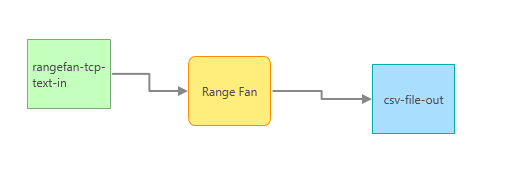

# Geometry Processors

The Geometry Processors demonstrate how to extend GeoEvent Processor to build custom processors that perform actions and processing on the geometries of a GeoEvent Service.  

## Features 

Multiple processors are included with the Geometry Processors:

* Buffer Processor - Converts the GeoEvent geometry to a buffer around the incoming event.
* Ellipse Processor - Converts the GeoEvent geometry to an ellipse centered on the incoming event geometry.
* Range Fan Processor - Converts the GeoEvent geometry to a range fan with an origin at the incoming event geometry.
* Visibility Processor - Generates a viewshed with an observer located at the incoming GeoEvent geometry.  The Visibility Processor also allows the user to clip the viewshed to a polygon.
* Query Report Processor - Executes a spatial query on feature services registered in GeoEvent Processor's data store.  The author of the service can then configures a report based on returned features.

## Sections

* [Requirements](#requirements)
* [Building](#building)
* [Installation](#installation)
* [Testing](#testing)
* [Licensing](#licensing)

## Requirements

* See common [solutions-geoevent-java requirements](../../../README.md#requirements).
* The ArcGIS Runtime for Java SDK is required in order to run the standalone Maven Tests included with this project.

## Building 

* See the [solutions-geoevent-java instructions](../../../README.md#instructions) for general instructions on 
    * verifying your Maven installation
    * setting the location of GeoEvent Processor and GeoEvent Processor SDK repositories
    * and any other common required steps
* Open a command prompt and navigate to `solutions-geoevent-java/solutions-geoevent/processors/geometry-processor`
    * Enter `mvn install` at the prompt.

## Installation

* Install the Geometry Processors.
    * Browse to `solutions-geoevent-java/solutions-processors/geometry-processor/target` (this directory is created when you execute mvn install).
    * Copy the .jar file and paste it into the deploy folder in the GeoEvent Processor install directory ([GeoEvent Processor install location]\deploy\ -- default location is C:\Program Files\ArcGIS\Server\GeoEventProcessor\deploy).
* Check for existing GeoEvent Definitions.
    *  Open GeoEvent Processor Manager.
    *  Navigate to ‘Site’ > ‘GeoEvent Processor’ > ‘GeoEvent Definitions’.
    *  Confirm GeoEvent Definition(s) exist for the processor(s) you want to run (e.g. if you are going to run the Buffer Processor, confirm a GeoEvent Definition is available as illustrated below).

* If these GeoEvent Definitions are not available, do the following to create these GeoEvent Definitions.
    *  Navigate to ‘Site’ > ‘GeoEvent Processor’ > ‘Configuration Store’ and click ‘Import Configuration’.
    *  Browse to `solutions-geoevent-java\data\configurations` and locate the `GeoEventDefinitions-GeometryProcessors.xml` configuration file. This file is located [here](../../../data/configurations/GeoEventDefinitions-GeometryProcessors.xml).
    *  On the Import Configuration dialog, click Import.

## Testing

### Validating the Installation
 
* See the [solutions-geoevent-java validation instructions](../../../README.md#validating-install).
    * Ensure the Buffer, Ellipse, Range Fan, Visibility, Query Report, etc. processors exist.

### Testing with Simulated Test Data

* In the following steps you will configure GeoEvent Processor to receive and process simulated data.
* The following example configures the Ran Fan Processor, the other processors can be configured in a similar manner.

* Open GeoEvent Processor Manager.
* Create an Input Connector to receive simulated data over TCP.
    * Navigate to ‘Site’ > ‘Services’ > 'Inputs'.
    * Click Add Input and select 'Receive text from a TCP Socket' and configure as illustrated below.

* Next, create an Output Connector to observe the received data.
    * Navigate to ‘Site’ > ‘Services’ > 'Outputs'.
    * Select Add Input and select 'Write to a .csv file' and configure the properties.
* Create a simple GeoEvent Service to direct the input data to the output using the selected processor.
    * An example GeoEvent Service and processor configuration is illustrated below.

* In GeoEvent Processor Manager, navigate to ‘Services’ > ‘Monitor’ and observe the GeoEvent Processor components, they should be similar to the illustration below (note: your names/outputs may differ).

* Using the GeoEvent Simulator, load the simulation file located at  solutions-geoevent-java\data\simulation_files\Geometry-RangeFans.csv
* In GeoEvent Processor Manager, navigate to 'Services' > 'Monitor' to observe that the values are increasing and the selected outputs are updated. 
* You can now test the processors with additional outputs such as published feature services.

## Licensing

Copyright 2013 Esri

Licensed under the Apache License, Version 2.0 (the "License");
you may not use this file except in compliance with the License.
You may obtain a copy of the License at

   [http://www.apache.org/licenses/LICENSE-2.0](http://www.apache.org/licenses/LICENSE-2.0)

Unless required by applicable law or agreed to in writing, software
distributed under the License is distributed on an "AS IS" BASIS,
WITHOUT WARRANTIES OR CONDITIONS OF ANY KIND, either express or implied.
See the License for the specific language governing permissions and
limitations under the License.

A copy of the license is available in the repository's
[license.txt](../../../license.txt) file.
