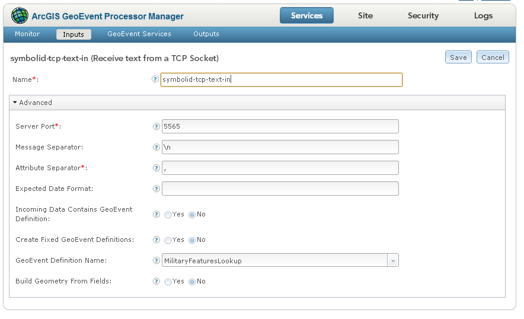
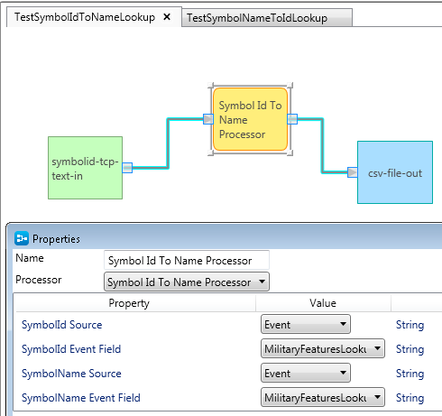
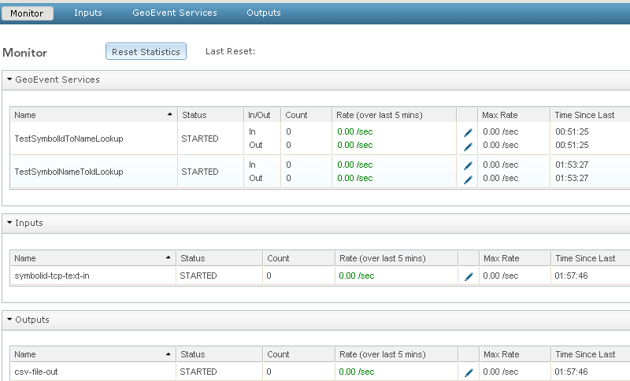
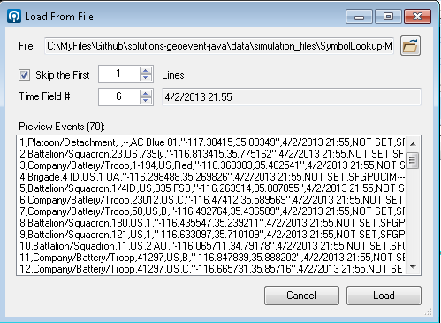

# symbol-lookup-processor

The symbol lookup processor demonstrates how to convert between military symbol names and symbol identification codes.

## Features 

* Converts Symbol Identification Codes (SIDCs) to well known symbol names.
* Converts well known symbol names to Symbol Identification Codes (SIDCs).

## Sections

* [Requirements](#requirements)
* [Building](#building)
* [Installation](#installation)
* [Testing](#testing)
* [Licensing](#licensing)

## Requirements

* See common [solutions-geoevent-java requirements](../../../README.md#requirements)
* The ArcGIS Runtime for Java SDK is required in order to run the standalone Maven Tests included with this project

## Building 

* See the [solutions-geoevent-java instructions](../../../README.md#instructions) for general instructions on 
    * verifying your Maven installation
    * setting the location of the GEP Server and GEP SDK repositories
    * and any other common required steps
 * Open a command prompt and navigate to `solutions-geoevent-java/solutions-geoevent/processors/symbol-lookup-processor`
 * * Enter `mvn install` at the prompt

## Installation

* Install the processor
    * Browse to `solutions-geoevent-java/solutions-processors/symbol-lookup-processor/target` (this directory is created when you execute mvn install).
    * Copy the jar file and paste it into the deploy directory on your GeoEvent Processor server (<GEP install location>\deploy\ -- default location is C:\Program Files\ArcGIS\Server\GeoEventProcessor\deploy)
    *  Open the GeoEvent Processor Manager web application and ensure that the SymbolIdToNameProcessor, SymbolNameToIdProcessor processors are present on the 'Site' > 'Components' > 'Processors' page.
* Check the existing geoevent definitions
    *  Open the GeoEvent Processor Manager web application.
    *  Navigate to ‘Site’ > ‘GeoEvent Processor’ > ‘GeoEvent Definitions’ 
    *  Confirm that there exists a GEP geoevent definition for MilitaryFeaturesLookup

* If the required definition is not available, do the following to install
    *  Navigate to ‘Site’ > ‘GeoEvent Processor’ > ‘Configuration Store’ and click ‘Import Configuration’
    *  Browse to `solutions-geoevent-java\data\configurations` and locate the `GeoEventDefinitions-MilitaryFeaturesLookup.xml` configuration file. This file is located [here](../../../data/configurations/GeoEventDefinitions-MilitaryFeatures.xml).
    *  On the GeoEvent Processor’s Import Configuration panel, click Import.

## Testing

### Validating the Installation
 
* See the [solutions-geoevent-java validation instructions](../../../README.md#validating-install).
    * Ensure that the SymbolIdToNameProcessor, SymbolNameToIdProcessor processors are present

### Testing with Simulated Test Data

* In the following steps you will configure GEP to receive and process simulated  data
* Open the GEP Manager web application
* Create a Input to receive simulated data over TCP 
    * Navigate to ‘Services’ > 'Inputs'
    * Select Add Input and configure a TCP Input as shown

* Next Create an Output to observe received data
    * Navigate to ‘Services’ > 'Outputs'
    * Select Add Output and configure an output to `Write to a .csv file`
    * On the Creating Output page, configure the Name, Folder, and Filename Prefix properties for your new output.
* Use the GEP Service Designer to
    * Create a simple service to direct the Input data to the Output using the selected processor
    * Set "SymbolId/SymbolName Event to an appropriate value (e.g. MilitaryFeaturesLookup::SymbolId/SymbolName )
    * The simple service and the processor configuration are shown below

* Navigate to ‘Services’ > ‘Monitor’ and observe that you have a configuration similar to the following (note: your names/outputs may differ)

* Run the GEP Simulator and load the simulation file at solutions-geoevent-java\data\simulation_files\SymbolLookup-MilitaryFeatures-SymbolIdOnly.csv

* Observe that the values increase on the GEP monitor and the selected outputs are updated. 
* Observer the output generated and verify that the symbol names and/or Id's have been converted.
* You may now test the processors with additional outputs such as published feature services

## Licensing

Copyright 2013 Esri

Licensed under the Apache License, Version 2.0 (the "License");
you may not use this file except in compliance with the License.
You may obtain a copy of the License at

   [http://www.apache.org/licenses/LICENSE-2.0](http://www.apache.org/licenses/LICENSE-2.0)

Unless required by applicable law or agreed to in writing, software
distributed under the License is distributed on an "AS IS" BASIS,
WITHOUT WARRANTIES OR CONDITIONS OF ANY KIND, either express or implied.
See the License for the specific language governing permissions and
limitations under the License.

A copy of the license is available in the repository's
[license.txt](../../../license.txt) file.
