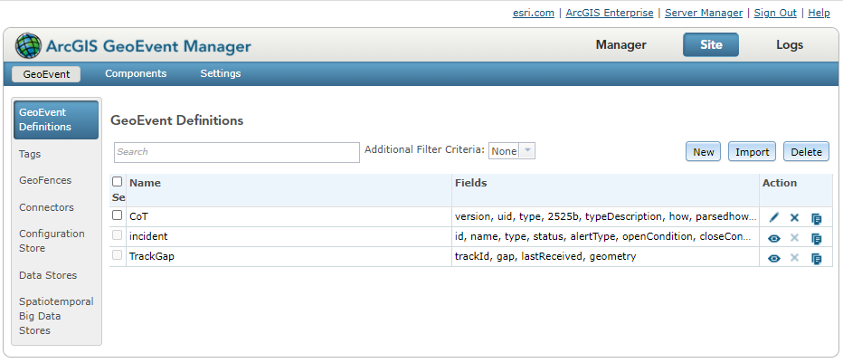
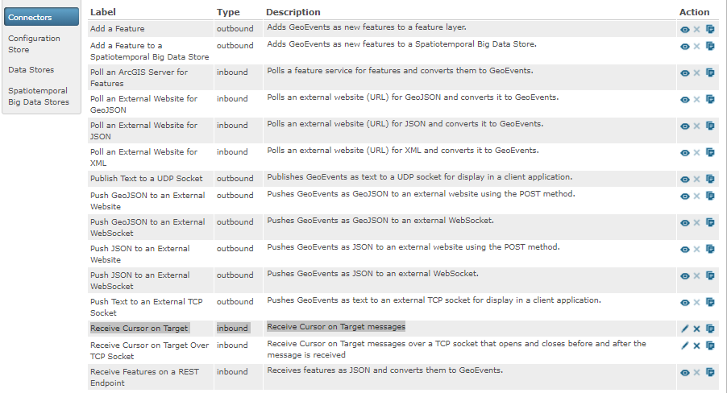
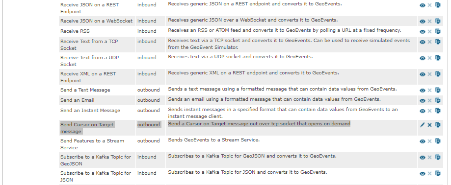
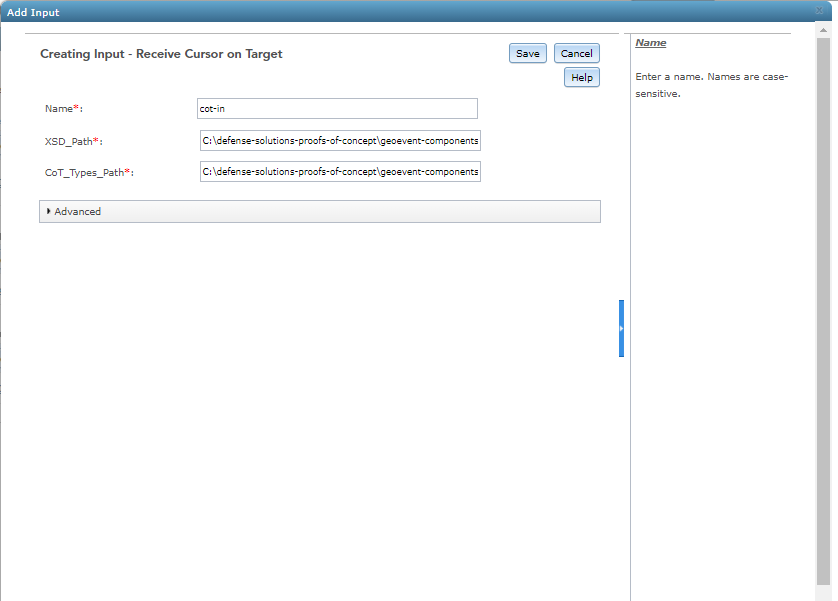
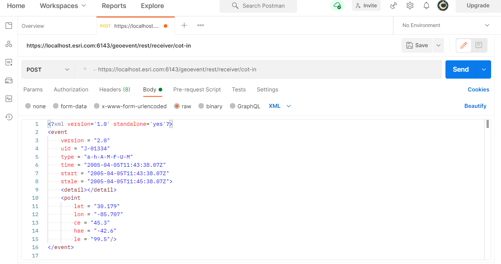

# CoT Adapter

The CoT Adapter provides an example of how to input Cursor on Target (CoT) XML messages as GeoEvents into ArcGIS GeoEvent Server.

## Features

* Receives XML messages conforming to the CoT message format.
* Converts messages received using available GeoEvent Definitions.

## Sections

* [Requirements](#requirements)
* [Building](#building)
* [Installation](#installation)
* [Testing](#testing)
* [Licensing](#licensing)

## Requirements

* See common [solutions-geoevent-java requirements](../../../README.md#requirements).
* This project is compiled using Java Development Kit (JDK) 8 so ensure that your JDK version is compatible.

## Building 

* See the [solutions-geoevent-java instructions](../../../README.md#instructions) for general instructions on 
    * verifying your Maven installation
    * setting the location of GeoEvent and GeoEvent SDK repositories
    * changing the version properties of GeoEvent in the pom.xml file
    * and any other common required steps
* Open a command prompt and navigate to `defense-solutions-proofs-of-concept\geoevent-components\solutions-geoevent\adapters\cot-adapter`
    * Enter `mvn install` at the prompt.

## Installation

* Install the CoT Adapter.
    * Browse to `defense-solutions-proofs-of-concept\geoevent-components\solutions-geoevent\adapters\cot-adapter\target` (this directory is created when you execute mvn install).
    * Copy the .jar file and paste it into the 'deploy' folder in the GeoEvent install directory ([GeoEvent install location]\deploy\ -- default location is C:\Program Files\ArcGIS\Server\GeoEvent\deploy).

## Testing

### Validating the Installation
 
* See the [solutions-geoevent-java validation instructions](../../../README.md#validating-install).

### Testing with Simulated Test Data

* In the following steps you will configure GeoEvent Processor to receive and process simulated CoT messages.
    * Navigate to 'Site' > 'GeoEvent' > 'GeoEvent Definitions'.
    * Note that a GeoEvent Definition named 'CoT' was created for you when you deployed the CoT Adapter.

    * Navigate to 'Site' > 'GeoEvent' > 'Connectors'.
    * Note a 'Receive Cursor on Target' inbound connector that receives messages over HTTP was created when you deployed the CoT Adapter. 

    * Note a 'Receive Cursor on Target Over TCP Socket' inbound connector that receives messages over a TCP socket that opens and closes before and after the message is received was created when you deployed the CoT Adapter.

    * Note a 'Send Cursor on Target' outbound connector that sends CoT messages over a TCP channel that opens on demand was created when you deployed the CoT Adapter.

    * Before creating input and output connectors, follow this process for each of the connectors above to ensure that the built-in connectors are successfully imported into GeoEvent Server. 
        * Click the pencil icon next to the new connector
        * Do not change anything. Instead, click the 'Save' button even though no changes are being made. This ensures the connectors are successfully imported and input and output connectors can be created.
* Next use GeoEvent Manager to:
    * Create a new Input Connector to receive CoT messages using the 'Receive Cursor on Target' connector created when you deployed the CoT Adapter.
	* For the XSD_Path property, use the location of the 'XSD-Add-on' folder downloaded from GitHub ([download location]\defense-solutions-proofs-of-concept\geoevent-components\solutions-geoevent\adapters\cot-adapter\src\main\resources\XSD-Add-on).
	* For the CoT_Types_Path property, use the location of the 'CoTtypes.xml' downloaded from GitHub ([download location]\defense-solutions-proofs-of-concept\geoevent-components\solutions-geoevent\adapters\cot-adapter\src\main\resources\CoTTypes\CoTtypes.xml).

    * Create a new Output Connector to write data to a JSON file using the 'Write to a JSON File' connector (note: this is not the 'Send Cursor on Target' outbound connector created when you deployed the CoT Adapter). Register a folder to store the JSON file.

    * Use the input and output connectors above to create and publish a simple GeoEvent Service that sends the input CoT messages to an output JSON file.

* Use an HTML poster application such as Postman (https://www.postman.com/downloads/) to send messages to the GeoEvent input.
    * Postman can be configured as illustrated below.

	* For the URL property, use the receiver endpoint of your CoT Input Connector in the form of: 'https://[host machine of geoevent processor]:6143/geoevent/rest/receiver/[name of input connector]'.    
	* Browse to the 'simulation_files' folder downloaded from github ([install location]\defense-solutions-proofs-of-concept\geoevent-components\data\simulation_files).
	* Open one of the CoT simulation files (named CoT.xml - CoT4.xml).
	* Copy and paste the contents into the window under the 'Body' tab of Postman.
    * Click on the 'Headers' tab and add a 'Content-Type' key with the value of 'text/xml'.
    * In the dropdown next to the URL, select 'POST'.
	* Click on the 'Send' button in Postman to send the data to the Input Connector.
* In GeoEvent Manager, navigate to 'Manager'. If your input, output, and service are all running, you should have received 1 input and sent 1 output (note: your names/outputs may differ).

* Repeat with the other simulation files if desired.
## Resources

* Learn more about Cursor on Target
    * [CoT User Guide](https://www.mitre.org/publications/technical-papers/cursorontarget-message-router-users-guide)

## Licensing

Copyright 2013 Esri

Licensed under the Apache License, Version 2.0 (the "License");
you may not use this file except in compliance with the License.
You may obtain a copy of the License at

   [http://www.apache.org/licenses/LICENSE-2.0](http://www.apache.org/licenses/LICENSE-2.0)

Unless required by applicable law or agreed to in writing, software
distributed under the License is distributed on an "AS IS" BASIS,
WITHOUT WARRANTIES OR CONDITIONS OF ANY KIND, either express or implied.
See the License for the specific language governing permissions and
limitations under the License.

A copy of the license is available in the repository's
[license.txt](../../../license.txt) file.

