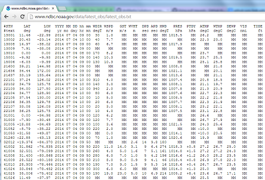

# regexText Adapter

___This repository is no longer maintained___

The regexText Adapter extends the out-of-the-box Text Adapter by enabling it to handle more complex Attribute Separators that can be defined using a (Java) Regular Expression.  It intercepts the input stream, replaces all matches of the Regular Expression with a simple, single-character, attribute separator, then passes the stream to the Text Adapter for processing as normal.
A good example of where it can be useful is where "any amount of white space" is used as a delimiter, as in this file of latest BUOY observations: http://www.ndbc.noaa.gov/data/latest_obs/latest_obs.txt.

## Features

* Handles delimited text input, where the delimiter is complex and can be defined by a Regular Expression (Java)
* Converts all matches of the Regular Expression in the incoming text into a single-character delimiter (e.g. a comma, but this is configurable)
* Care should be taken to ensure that the single-character delimiter does not already exist in the data
* Passes the adapted incoming text to the base implementation of the out-of-the-box Text Adapter for processing as normal

## Sections

* [Requirements](#requirements)
* [Building](#building)
* [Installation](#installation)
* [Testing](#testing)
* [Licensing](#licensing)

## Requirements

* See common [solutions-geoevent-java requirements](../../../README.md#requirements)
* There are no additional requirements for this project

## Building 

* See the [solutions-geoevent-java instructions](../../../README.md#instructions) for general instructions on 
    * verifying your Maven installation
    * setting the location of the GeoEvent Processor and GeoEvent Processor SDK repositories
    * and any other common required steps
 * Open a command prompt and navigate to `solutions-geoevent-java/solutions-geoevent/adapters/regexText-adapter
* Enter `mvn install` at the prompt

## Installation

* Install the adapter
    * Browse to `solutions-geoevent-java/solutions-geoevent/adapters/regexText-adapter/target` (this directory is created when you execute mvn install).
    * Copy the geomessage-adapter-{version}.jar file and paste it into the deploy folder in the GeoEvent Processor install directory ([GeoEvent Processor install location]\deploy\ -- default location is C:\Program Files\ArcGIS\Server\GeoEventProcessor\deploy).
    * Open the GeoEvent Processor Manager web application and ensure that the regexText Adapter is present on the 'Site' > 'Components' > 'Adapters' page.

## Testing

### Validating the Installation
 
* See the [solutions-geoevent-java validation instructions](../../../README.md#validating-install).

### Testing with Live Data

* This adapter can be tested with weather data reported from Buoys in our oceans and seas.

* See the [solutions-geoevent-java/data/weather import instructions](../../../data/weather/README.md).

## Licensing

Copyright 2014 Esri

Licensed under the Apache License, Version 2.0 (the "License");
you may not use this file except in compliance with the License.
You may obtain a copy of the License at

   [http://www.apache.org/licenses/LICENSE-2.0](http://www.apache.org/licenses/LICENSE-2.0)

Unless required by applicable law or agreed to in writing, software
distributed under the License is distributed on an "AS IS" BASIS,
WITHOUT WARRANTIES OR CONDITIONS OF ANY KIND, either express or implied.
See the License for the specific language governing permissions and
limitations under the License.

A copy of the license is available in the repository's
[license.txt](../../../license.txt) file.

