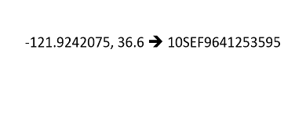

# Lat/Lon to MGRS Processor

Lat/Lon to MGRS Processor - Converts Lat Long coordinates into MGRS coordinate. 

## Sections

* [Requirements](#requirements)
* [Building](#building)
* [Installation](#installation)
* [Testing](#testing)
* [Licensing](#licensing)

## Requirements

* See common [solutions-geoevent-java requirements](../../../README.md#requirements).
* The ArcGIS Runtime for Java SDK is required in order to run the standalone Maven Tests included with this project.

## Building 

* See the [solutions-geoevent-java instructions](../../../README.md#instructions) for general instructions on 
    * verifying your Maven installation
    * setting the location of GeoEvent Processor and GeoEvent Processor SDK repositories
    * changing the version properties to match your GeoEvent Server version in the pom.xml file
    * and any other common required steps
* Open a command prompt and navigate to `defense-solutions-proofs-of-concept\geoevent-components\solutions-geoevent\processors\ll2mgrs`
    * Enter `mvn install` at the prompt.

## Installation

* Install the ll2mgrs Processor.
    * Browse to `defense-solutions-proofs-of-concept\geoevent-components\solutions-geoevent\processors\ll2mgrs\target` (this directory is created when you execute mvn install).
    * Copy the .jar file and paste it into the deploy folder in the GeoEvent Processor install directory ([GeoEvent Processor install location]\deploy\ -- default location is C:\Program Files\ArcGIS\Server\GeoEventProcessor\deploy).

## Testing

### Validating the Installation
 
* See the [solutions-geoevent-java validation instructions](../../../README.md#validating-install).
* In GeoEvent Server, navigate to the "Site" tab and click the "Components" tab in the blue ribbon. In the "Processors" tab, scroll until you see the two ll2mgrs processors that you imported. You are ready to test the processors.

### Testing with Simulated Test Data

#### Testing the Component

The Introduction to GeoEvent tutorial no longer appears to have a TCP-Console application to aid in the testing of this processor. Instead, it will be tested by writing the geoevents to a JSON file folder.

##### Test Lat/Lon to MGRS
You will need to manually create a definition, an input connector, a geoevent service, and an output of your choice to test the functionality of the ll2mgrs processor.
* Navigate to 'Site' > 'GeoEvent Definitions'. You will not see any definitions for the ll2mgrs processors. The input connector requires an existing GeoEvent definition so you will need to create one:
    * Click the 'New' button to create a new GeoEvent definition.
    * Name the definition and click 'Create'.
    * Add fields corresponding to the data columns in the testLL2MGRS.csv and the save the definition. 

  

* On the GeoEvent Manager page, click 'Add Input' to add an input connector:
    * Select 'Receive Text from a TCP Socket'
    * Name the input, add the appropriate advanced properties according to the picture below, then click 'Save'. Note that for the GeoEvent Definition Name (Existing), the definition you made in the previous step appears in the drop-down menu. Select this definition. 

  

* On the GeoEvent Manager page, click 'Add Output' to add an output connector:
    * Select 'Write to a JSON File'. This is a simple way to see the output and verify the processor works as intended.
    * Name the output, register a folder on your server where you want the output geoevents to be written and stored.
    * Add a filename prefix of your choice (ex. 'll2mgrs').
    * Click 'Save'.

  

* On the GeoEvent Manager page, click 'Add Service' to add a service:
    * Name the service and click 'Create'.
    * Add the 'll2mgrs-tcp-text-in' input.
    * Add a new processor element with appropriate values similar to the image below:

  

* Add the 'll2mgrs-file-json-out' output. The service should look like the image below:

  

* Open the ArcGIS GeoEvent Simulator (this is installed with GeoEvent Extension and can be found at the GeoEvent Extension install location).
* Make sure the Server points to the server on which GeoEvent Extension is deployed (default is localhost).
* In the upper right, change the port to 5685 to match the port of the input and click the button with the red X to connect (Note: if you cannot connect, the server is not listening on that port. This may be because the input in GeoEvent has not been started).
* Make sure 'File' is selected in the combo box on the upper left.
* Click the 'Load File' button in the upper right.
* In the new dialog, click the file folder button in the upper right.
* Browse to the .\defense-solutions-proofs-of-concept\geoevent-components\data\simulation-files\ directory.
* Select testLL2MGRS.csv and click 'Open'
* Click the 'Load' button. In the Preview Edits window you will see 22 records.

  

* In the GeoEvent Simulator click the 'Step' button.
* If everything is configured properly in GeoEvent Manager, you will see that the counts for the input, the service, and the output all increase.
* To check that the processor successfully converted the latitude and longitude to MGRS, browse to the folder you created for the output connector. Open the json file and see that a new field has been added containing the correct MGRS conversion.

##### Test MGRS to Lat/Lon
You will need to manually create a definition, an input connector, a geoevent service, and an output of your choice to test the functionality of the ll2mgrs processor.
* Navigate to 'Site' > 'GeoEvent Definitions'. You will not see any definitions for the mgrs2ll processor. The input connector requires an existing GeoEvent definition so you will need to create one:
    * Click the 'New' button to create a new GeoEvent definition.
    * Name the definition and click 'Create'.
    * Add fields corresponding to the data columns in the testMGRS2LL.csv

  

* On the GeoEvent Manager page, click 'Add Input' to add an input connector:
    * Select 'Receive Text from a TCP Socket'
    * Name the input, add the appropriate advanced properties according to the picture below, then click 'Save'. Note that for the GeoEvent Definition Name (Existing), the definition you made in the previous step appears in the drop-down menu. Select this definition. 

  

* On the GeoEvent Manager page, click 'Add Output' to add an output connector:
    * Select 'Write to a JSON File'. This is a simple way to see the output and verify the processor works as intended.
    * Name the output, register a folder on your server where you want the output geoevents to be written and stored.
    * Add a filename prefix of your choice (ex. 'mgrs2ll').
    * Click 'Save'.

  

* On the GeoEvent Manager page, click 'Add Service' to add a service:
    * Name the service and click 'Create'.
    * Add the 'mgrs2ll-tcp-text-in' input.
    * Add a new processor element with appropriate values similar to the image below:

  

* Add the 'mgrs2ll-file-json-out' output. The service should look like the image below:

  

* Open the ArcGIS GeoEvent Simulator (this is installed with GeoEvent Extension and can be found at the GeoEvent Extension install location).
* Make sure the Server points to the server on which GeoEvent Extension is deployed (default is localhost).
* In the upper right, change the port to 5695 to match the port of the input and click the button with the red X to connect (Note: if you cannot connect, the server is not listening on that port. This may be because the input in GeoEvent has not been started).
* Make sure 'File' is selected in the combo box on the upper left.
* Click the 'Load File' button in the upper right.
* In the new dialog, click the file folder button in the upper right.
* Browse to the .\defense-solutions-proofs-of-concept\geoevent-components\data\simulation-files\ directory.
* Select testMGRS2LL.csv and click 'Open'
* Click the 'Load' button. In the Preview Edits window you will see 4 records.

  

* In the GeoEvent Simulator click the 'Step' button.
* If everything is configured properly in GeoEvent Manager, you will see that the counts for the input, the service, and the output all increase.
* To check that the processor successfully converted the MGRS values to latitude and longitude, browse to the folder you created for the output connector. Open the json file and see that the 'Geometry' field has been updated with the correct latitude, longitude, and spatial reference.

## Licensing

Copyright 2014 Esri

Licensed under the Apache License, Version 2.0 (the "License");
you may not use this file except in compliance with the License.
You may obtain a copy of the License at

   [http://www.apache.org/licenses/LICENSE-2.0](http://www.apache.org/licenses/LICENSE-2.0)

Unless required by applicable law or agreed to in writing, software
distributed under the License is distributed on an "AS IS" BASIS,
WITHOUT WARRANTIES OR CONDITIONS OF ANY KIND, either express or implied.
See the License for the specific language governing permissions and
limitations under the License.

A copy of the license is available in the repository's
[license.txt](../../../license.txt) file.

