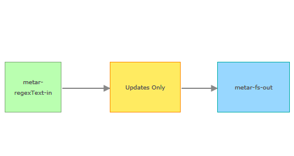

# updateOnly-processor

The updateOnly processor filters out GeoEvents that do not offer more recent information than that already received.
To do this, it maintains an in-memory cache of the attribute tagged TRACK_ID mapped against the attribute tagged TIME_START.
When incoming GeoEvents have a TRACK_ID that is already held in the cache, but do not have a more recent TIME_START, they are filtered out.

## Features 

* Maintains an in-memory map (cache) of TRACK_ID :: TIME_START, adding to or updating it with each new GeoEvent received
* Checks the TRACK_ID and TIME_START of each new incoming GeoEvent against the cache
* If the incoming GeoEvent's TRACK_ID is not in the cache, it is added, together with its TIME_START, and the GeoEvent is passed through.
* If the TRACK_ID already has an entry in the cache, the TIME_START of the incoming GeoEvent is compared with that held in the cache
* If the TIME_START of the GeoEvent is not later than that held in the cache, the GeoEvent is filtered out
* Allows a user to clear the cache through a configuration option (e.g. in case, for some other reason, events that this processor has already processed have not been reaching their destination)

## Sections

* [Requirements](#requirements)
* [Building](#building)
* [Installation](#installation)
* [Testing](#testing)
* [Licensing](#licensing)

## Requirements

* See common [solutions-geoevent-java requirements](../../../README.md#requirements)
* The ArcGIS Runtime for Java SDK is required in order to run the standalone Maven Tests included with this project

## Building 

* See the [solutions-geoevent-java instructions](../../../README.md#instructions) for general instructions on 
    * verifying your Maven installation
    * setting the location of the GEP Server and GEP SDK repositories
    * and any other common required steps
 * Open a command prompt and navigate to `solutions-geoevent-java/solutions-geoevent/processors/updateOnly-processor`
 * * Enter `mvn install` at the prompt

## Installation

* Install the processor
    * Browse to `solutions-geoevent-java/solutions-processors/updateOnly-processor/target` (this directory is created when you execute mvn install).
    * Copy the jar file and paste it into the deploy directory on your GeoEvent Processor server (<GEP install location>\deploy\ -- default location is C:\Program Files\ArcGIS\Server\GeoEventProcessor\deploy)
    * Open the GeoEvent Processor Manager web application and ensure that the UpdateOnlyProcessor processor is present on the 'Site' > 'Components' > 'Processors' page.

## Testing

### Validating the Installation
 
* See the [solutions-geoevent-java validation instructions](../../../README.md#validating-install).

### Testing with Live Data

* This processor can be tested with weather data reported from aerodromes (METAR) and Buoys or CMAN stations (BUOY). The input data files contain data for hundreds or thousands of stations, only a few of which may have been updated since the previous poll.

* See the [solutions-geoevent-java/data/weather import instructions](../../../data/weather/README.md).

## Licensing

Copyright 2014 Esri

Licensed under the Apache License, Version 2.0 (the "License");
you may not use this file except in compliance with the License.
You may obtain a copy of the License at

   [http://www.apache.org/licenses/LICENSE-2.0](http://www.apache.org/licenses/LICENSE-2.0)

Unless required by applicable law or agreed to in writing, software
distributed under the License is distributed on an "AS IS" BASIS,
WITHOUT WARRANTIES OR CONDITIONS OF ANY KIND, either express or implied.
See the License for the specific language governing permissions and
limitations under the License.

A copy of the license is available in the repository's
[license.txt](../../../license.txt) file.

