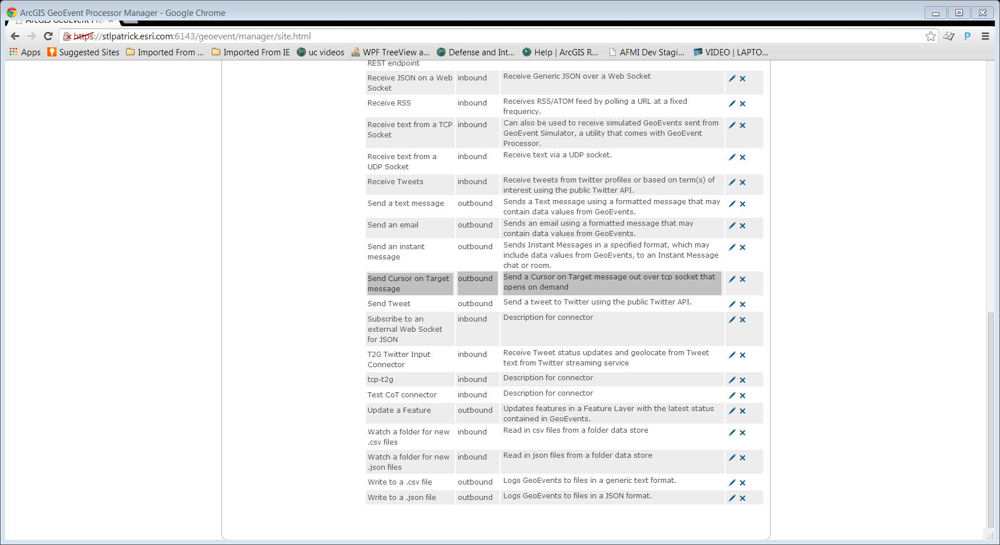
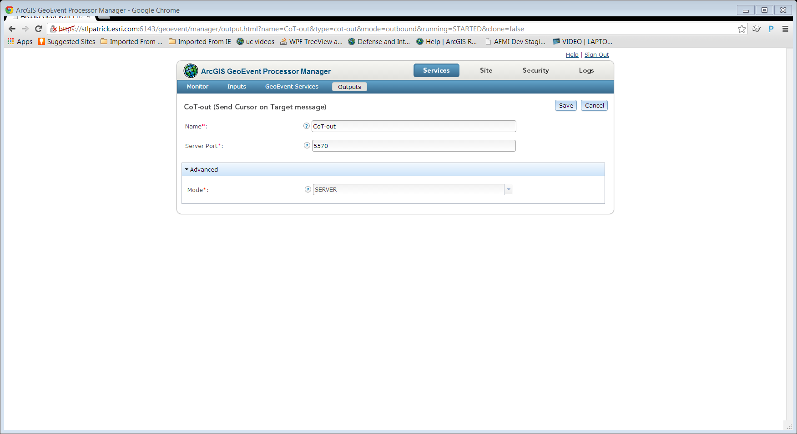
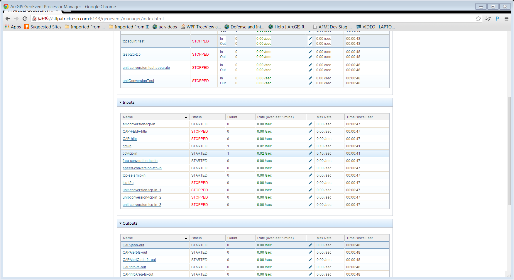

#TCP Squirt Transport

The TCP-Squirt transport provides an example of how to send TCP on demand. TCP Squirt is specifically designed for use with Cursor on Target Outbound connectors

## Features

* Sends messages over TCP Socket on demand
* Opens and closes the socket before and after sending message

## Sections

* [Requirements](#requirements)
* [Building](#building)
* [Installation](#installation)
* [Testing](#testing)
* [Licensing](#licensing)

## Requirements

* See common [solutions-geoevent-java requirements](../../../../README.md#requirements)
* There are no additional requirements for this project

## Building 

* See the [solutions-geoevent-java instructions](../../../../README.md#instructions) for general instructions on 
    * verifying your Maven installation
    * setting the location of the GEP Server and GEP SDK repositories
    * and any other common required steps
 * Open a command prompt and navigate to `solutions-geoevent-java/solutions-geoevent/transports/tcpSquirt-transport`
 * * Enter `mvn install` at the prompt

## Installation

* Install the transport
    * Browse to `solutions-geoevent-java/solutions-geoevent/transports/tcpSquirt-transport/target` (this directory is created when you execute mvn install).
    * Copy the jar file and paste it into the deploy directory on your GeoEvent server (<GEP install location>\deploy\ -- default location is C:\Program Files\ArcGIS\Server\GeoEventProcessor\deploy)

## Testing

### Validating the Installation
 
* See the [solutions-geoevent-java validation instructions](../../../../README.md#validating-install).

### Testing with Simulated Test Data

* After Deploying TCP-Squirt and the CoT adapter open GeoEvent Manager and browse to Site->Connectors.  You should see an output connector created for you called labeled Send Cursor on Target message

* in GeoEvent Manager application, brouse to Services->Outputs
* Click 'Add Output'
* Set up the CoT output as described in the figure below

* Next you will set upp an input service to receive a tcp message
  * In GeoEvent Manager go to Services->Inputs and click 'Add Input'
  * Click Add CoT the button next to Receive Cursor on Target over TCP
  * Set the CoT Types and XSD Paths to the locations of those files
  * Set a server port to listen from
  * Click Save
* To test tcp squirt see [building, installing, and testing the CoT Adapter  instructions](../../adapters/cot-adapter/README.md#building)
* Note that one step is to create the TCP-Squirt Output and add it to the tcp service
* Make sure that you set the client connection tcp port in the cot-out to the same port as the tcp server port on cot-tcp-in
* Run the simulation from the CoT adapter
* Go to Services->monitor
* Note that the the cot-tcp-in has received a message

## Resources

* Learn more about the Cursor on Target
    * [CoT](http://cot.mitre.org/index.html)

## Licensing

Copyright 2013 Esri

Licensed under the Apache License, Version 2.0 (the "License");
you may not use this file except in compliance with the License.
You may obtain a copy of the License at

   [http://www.apache.org/licenses/LICENSE-2.0](http://www.apache.org/licenses/LICENSE-2.0)

Unless required by applicable law or agreed to in writing, software
distributed under the License is distributed on an "AS IS" BASIS,
WITHOUT WARRANTIES OR CONDITIONS OF ANY KIND, either express or implied.
See the License for the specific language governing permissions and
limitations under the License.

A copy of the license is available in the repository's
[license.txt](../../../license.txt) file.
